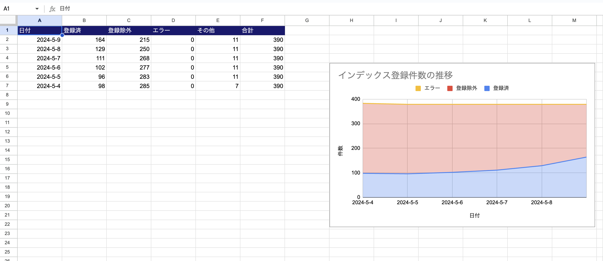

# Google Search Console検査自動化ツール（β）

Google Search Consoleの情報をスプレッドシートに出力するGoogle Apps Script（GAS）プロジェクトです。

ローカル環境で開発し、Claspを利用してGASにデプロイできます。

ツールの設定については「[設定手順](./docs/SETTING.md)」を参照してください。

## 主な機能
- URL検索
- インデックス状況の推移レポート作成

### URL検索機能
対象のサイトマップ情報を利用して、URLのインデックス状況を自動取得し、スプレッドシートに出力します。


Google Search Console の [URL Inspection API](https://developers.google.com/webmaster-tools/v1/urlInspection.index/inspect?hl=ja) を利用して、URLのインデックス状況を取得します。

URL検索は実行に時間がかかるため、スプレッドシートに出力されるまでに時間がかかります。また、一度に大量のページを処理するとタイムアウトが発生する可能性があります。ページ数が多い場合は、分割して検査を行ってください。

- ※ 1ページの検査で6秒程度かかります。
- ※ 100ページ以上は分割実行を推奨します。

### インデックス状況の推移レポート作成機能
URL検索機能で取得したデータを元に、インデックス状況の推移レポートを作成します。



## 主な依存関係

- [Google Apps Script](https://workspace.google.co.jp/intl/ja/products/apps-script/)
- [Clasp](https://github.com/google/clasp)

## 必要な環境

- [Bun](https://bun.sh/)

プロジェクト内ではTypeScriptを利用しています。

## 利用方法

このリポジトリをクローンし、依存関係をインストールします。

```bash
bun install
```

### Googleアカウントにログイン

```shell
bun clasp:login
```

### Google Apps Scriptプロジェクトを作成

`.clasp.json`を作成し、以下の設定を追加します。
スクリプトIDを取得し、`<SCRIPT_ID>`に置き換えます。

```json
{
  "scriptId": "<SCRIPT_ID>",
  "rootDir": "./dist"
}
```

コードをスクリプトにデプロイします。

```shell
bun release
```

## 利用可能なコマンド

プロジェクトのビルドを行います。

```shell
bun postBuild
```

プロジェクトコードをビルドし、スクリプトをデプロイします。

```shell
bun release
```

スクリプトを開きます。

```shell
bun clasp:open
```

## ライセンス
MIT