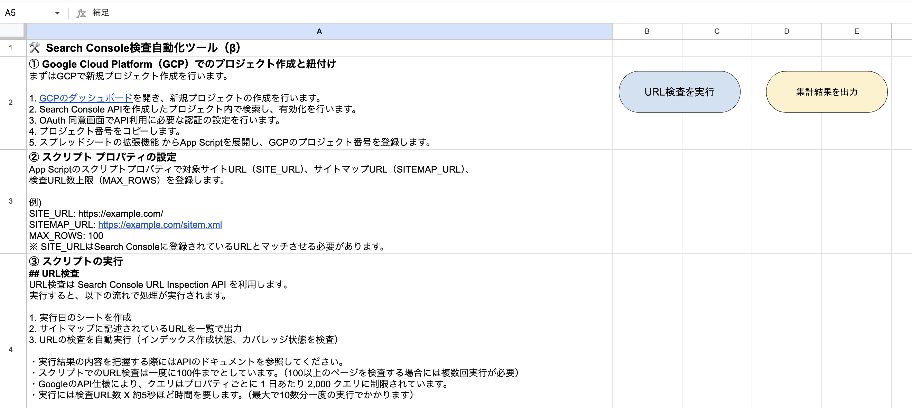

# 🛠️ 設定手順
本プロジェクト利用に必要な設定方法を記載しています。

## ① Google Cloud Platform（GCP）でのプロジェクト作成と紐付け
まずはGCPで新規プロジェクト作成を行います。

1. [GCPのダッシュボード](https://console.cloud.google.com/apis/dashboard)を開き、新規プロジェクトの作成を行います。
2. Search Console APIを作成したプロジェクト内で検索し、有効化を行います。
3. OAuth 同意画面でAPI利用に必要な認証の設定を行います。
4. プロジェクト番号をコピーします。
5. スプレッドシートの拡張機能 からApp Scriptを展開し、GCPのプロジェクト番号を登録します。


## ② スクリプト プロパティの設定
App Scriptのスクリプトプロパティで対象サイトURL（SITE_URL）、サイトマップURL（SITEMAP_URL）、
検査URL数上限（MAX_ROWS）を登録します。

例:
```
SITE_URL: https://example.com/
SITEMAP_URL: https://example.com/sitemap.xml
MAX_ROWS: 100
```
※ SITE_URLはSearch Consoleに登録されているURLとマッチさせる必要があります。

### 💎 スクリプト プロパティ一覧
手動設置が必要なプロパティは以下になります。

```
SITE_URL: サイトURL（末尾に / つける）
SITEMAP_URL: サイトマップURL
MAX_ROWS: URL検査を一度に実行する際の上限
```

## ③ スクリプトの実行
スクリプトの実行を行い、処理が正常に完了することを確認します。

- index.gs（`main` 関数）: URL検査を実行
- report.gs（`report` 関数）: インデックス状況の推移レポート作成

### URL検査
URL検査は Search Console URL Inspection API を利用します。
実行すると、以下の流れで処理が実行されます。

1. 実行日のシートを作成
2. サイトマップに記述されているURLを一覧で出力
3. URLの検査を自動実行（インデックス作成状態、カバレッジ状態を検査）

注意事項:
- 実行結果の内容を把握する際にはAPIのドキュメントを参照してください。
- スクリプトでのURL検査実行上限を超える場合は、複数回に分けて実行してください。
- GoogleのAPI仕様により、クエリはプロパティごとに 1 日あたり 2,000 クエリに制限されています。
- 実行には検査URL数 X 約6秒ほど時間を要します。


### インデックス状況の推移レポート作成
実行日毎の集計結果を一覧で出力します。
実行すると、以下の流れで処理が実行されます。

1. 集計シートを作成
2. 日付毎の検査結果を集計
3. 集計結果を元に積み上げ面グラフを作成


## 実行用のUIを設置（任意）
スクリプトの実行を行うためのUIを設置することで、任意のタイミングで処理を実行しやすくなります。

READMEシートを作成し、以下のようにボタンUIを設置し、関数を割り当てます。


